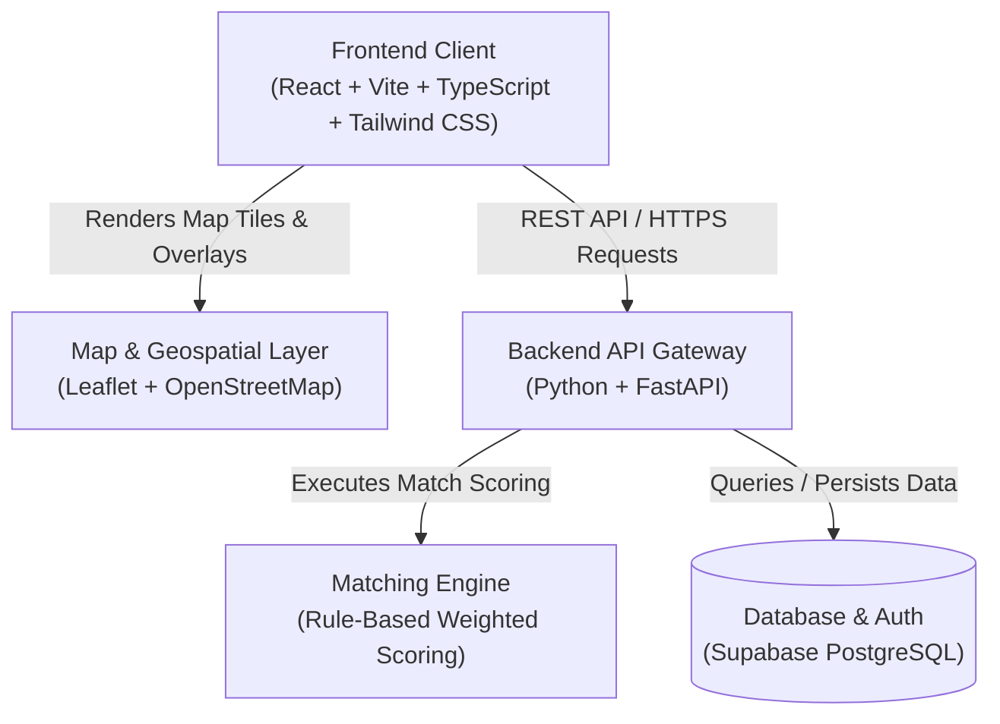
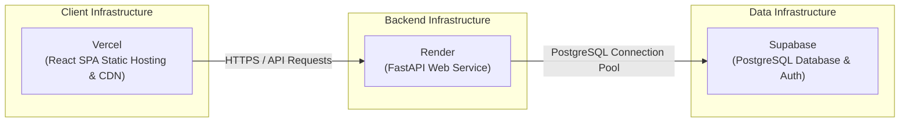

# CarbonLoop - High-Level Planned Architecture

This document provides a high-level overview of the planned system architecture for **CarbonLoop**, a B2B Carbon Capture-to-Product Matchmaking Marketplace.

---

## 1. System Overview

CarbonLoop facilitates commercial transactions, technical compatibility checks, and logistics coordination between carbon capture suppliers (emitters) and carbon utilization buyers (off-takers).

---

## 2. Approved Technology Stack

| Layer | Technology | Primary Role |
| :--- | :--- | :--- |
| **Frontend** | **React**, **Vite**, **TypeScript**, **Tailwind CSS** | Single-page marketplace web application, listings explorer, buyer/seller dashboards, and analytics |
| **Backend** | **Python**, **FastAPI** | RESTful API service, business logic, authentication validation, and matching engine orchestration |
| **Database** | **Supabase PostgreSQL** | Relational storage for organizations, capture facilities, utilization plants, listings, criteria, and matches |
| **Matching Engine** | **Python (Rule-Based Weighted Scoring)** | Deterministic multi-attribute decision analysis evaluating purity, volume, delivery pressure/state, and distance |
| **Maps & Geospatial** | **Leaflet**, **OpenStreetMap** | Interactive mapping displaying emitter clusters, off-taker facilities, and transit corridors |
| **Deployment** | **Vercel** (Frontend) **Render** (Backend) **Supabase** (Database) | Managed cloud infrastructure for scalable hosting and continuous deployment |

---

## 3. High-Level Architectural Components

### 3.1 Frontend Layer (React + Vite + TypeScript + Tailwind CSS)
- **Role**: Delivers a responsive, type-safe user interface for emitters and off-takers.
- **Key Modules**:
  - **Marketplace Explorer**: Search, filter, and view capture streams and utilization requirements.
  - **Matchmaking Dashboard**: View scored recommendations, compatibility breakdowns, and distance metrics.
  - **Geospatial Map View**: Interactive Leaflet map powered by OpenStreetMap tiles to inspect regional clusters and transport feasibility.
  - **Listing Management**: Forms for emitters and buyers to define detailed gas composition and volumetric specs.

### 3.2 Backend Layer (Python + FastAPI)
- **Role**: Provides asynchronous REST API endpoints with request validation and structured schemas.
- **Key Responsibilities**:
  - Expose endpoints for listing management, search, and profile operations.
  - Orchestrate matchmaking requests by feeding supply and demand records into the scoring engine.
  - Handle data persistence and transactional integrity with the database.

### 3.3 Matching Engine (Python Rule-Based Weighted Scoring)
- **Role**: Calculates compatibility scores between CO₂ capture streams and utilization intake requirements.
- **Evaluation Criteria**:
  - **Purity & Composition Match**: Assesses CO₂ percentage and tolerance for impurities (H₂O, SOx, NOx, particulates).
  - **Volume & Flow Match**: Compares supply capacity against demand thresholds and delivery consistency.
  - **State & Pressure Compatibility**: Validates whether the delivered physical state (gas, liquefied, supercritical) meets plant specifications.
  - **Geographical Distance**: Computes proximity-based scores to minimize transport logistics and emissions.

### 3.4 Spatial & Mapping Services (Leaflet + OpenStreetMap)
- **Role**: Provides client-side geospatial rendering without proprietary map vendor lock-in.
- **Capabilities**:
  - Visualizing point sources (emitters) and sinks (utilization plants).
  - Highlighting transport corridors and radius-based proximity rings.

### 3.5 Data & Persistence Layer (Supabase PostgreSQL)
- **Role**: Serves as the central relational data store.
- **Primary Entities**:
  - `organizations`: Profiles for emitter enterprises and utilization buyers.
  - `facilities`: Geographic locations, facility types, and operating parameters.
  - `listings`: Active supply feeds and procurement requests.
  - `matches`: Generated match scores, scoring breakdowns, and status tracking.

---

## 4. Deployment Architecture

- **Frontend (Vercel)**: Hosts static bundle generated by Vite with CDN caching and edge distribution.
- **Backend (Render)**: Hosts the containerized or native Python FastAPI web service with automated deployment pipelines.
- **Database (Supabase)**: Managed PostgreSQL instance providing persistent storage, automatic backups, and role-based access.
